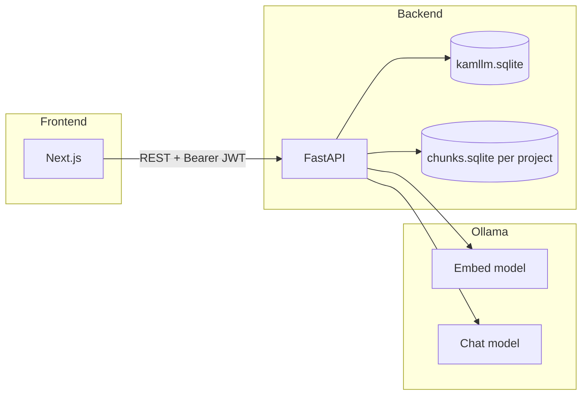

# KAMLLM

**Self-hosted, NotebookLM-style workspaces:** sign in, create projects, upload PDFs per project, and chat with retrieval grounded in your documents. The stack pairs a **FastAPI** backend with a **Next.js** web UI and **Ollama** for local embeddings and chat.

---

## Features

- **Accounts** — Register and sign in; passwords hashed with bcrypt; sessions via **JWT** bearer tokens.
- **Workspaces (projects)** — Each project has its own SQLite-backed chunk index; data lives under configurable `data/` paths.
- **PDF ingestion** — Multi-file upload with optional index reset between runs.
- **RAG chat** — Questions are answered using retrieved chunks from the **current** workspace only (plus your configured chat model).

---

## Architecture



---

## Prerequisites

| Requirement | Purpose |
|-------------|---------|
| **Python 3.10+** | Backend package and CLI |
| **Node.js 18+** (recommended) | Next.js frontend |
| **Ollama** | Embedding and chat HTTP API (default `http://127.0.0.1:11434`) |
| Matching **models** | Set `OLLAMA_CHAT_MODEL` and `OLLAMA_EMBED_MODEL` to models you have pulled |

Example (adjust names to your installation):

```bash
ollama pull nomic-embed-text
ollama pull qwen2.5-coder:7b
```

---

## Quick start

### 1. Backend API

Always run installs and the server with **`backend` as the current working directory** so `.env`, `data/`, and relative paths resolve correctly.

```bash
cd backend
python -m venv .venv
# Windows: .venv\Scripts\activate
# macOS/Linux: source .venv/bin/activate

pip install -e .
copy .env.example .env   # Windows — or: cp .env.example .env
```

Edit **`.env`**. At minimum:

- **`JWT_SECRET`** — Long random string (required for auth in production).
- **`OLLAMA_CHAT_MODEL`** / **`OLLAMA_EMBED_MODEL`** — Must match pulled Ollama models.

Start the API:

```bash
python -m kamllm.api_main
```

Default bind: **`http://127.0.0.1:8765`**.

**Windows helpers** (from repo root): `kamllm-api.cmd` changes into `backend` and runs `python -m kamllm.api_main`.

### 2. Frontend

```bash
cd frontend
npm install
copy .env.example .env.local   # set NEXT_PUBLIC_API_URL if the API is not on 127.0.0.1:8765
npm run dev
```

Open **`http://localhost:3000`**. CORS is preconfigured for `localhost:3000` and `127.0.0.1:3000` on the API side.

### 3. First use

1. **Create account** (or sign in).
2. **New** workspace — pick a name and create a project.
3. **Upload PDFs** in the sidebar (optionally **clear index before this upload**).
4. **Chat** once the workspace health shows chunks and “chat ready”.

---

## Configuration

Backend variables (see **`backend/.env.example`**):

| Variable | Description |
|----------|-------------|
| `OLLAMA_BASE_URL` | Ollama HTTP base URL |
| `OLLAMA_CHAT_MODEL` | Chat/completion model name |
| `OLLAMA_EMBED_MODEL` | Embedding model name |
| `CHUNK_CHAR_SIZE` / `CHUNK_CHAR_OVERLAP` | Text chunking |
| `TOP_K_CHUNKS` | Default retrieval breadth |
| `CHROMA_PATH` | Legacy name; directory used for the **CLI** default index (API workspaces use `data/` subpaths) |
| `JWT_SECRET` | **Required** for signing tokens |
| `JWT_EXPIRE_DAYS` | Optional token lifetime |
| `KAMLLM_DATA_DIR` | App DB and project indexes directory (default `data`, relative to CWD, usually `backend/data`) |
| `KAMLLM_API_HOST` / `KAMLLM_API_PORT` | Bind address/port for `python -m kamllm.api_main` |
| `KAMLLM_CORS_ORIGINS` | Comma-separated browser origins |

Frontend (**`frontend/.env.local`**):

| Variable | Description |
|----------|-------------|
| `NEXT_PUBLIC_API_URL` | Public API origin (no trailing slash), e.g. `http://127.0.0.1:8765` |

---

## Data layout

With default `KAMLLM_DATA_DIR=data` (under `backend/` when you run from there):

- **`data/kamllm.sqlite`** — Users and project metadata.
- **`data/projects/<public_id>/`** — Per-project RAG storage (including `chunks.sqlite` used by ingestion).

`.gitignore` excludes `backend/data/` so local databases are not committed.

---

## HTTP API (summary)

Public / unauthenticated:

| Method | Path | Description |
|--------|------|-------------|
| `GET` | `/api/health` | Ollama + model readiness (no user index loaded) |

Authenticated (`Authorization: Bearer <token>`):

| Method | Path | Description |
|--------|------|-------------|
| `POST` | `/api/auth/register` | `{ "email", "password" }` (min length 8) → `{ access_token }` |
| `POST` | `/api/auth/login` | `{ "email", "password" }` → `{ access_token }` |
| `GET` | `/api/auth/me` | Current user |
| `GET` | `/api/projects` | List workspaces |
| `POST` | `/api/projects` | `{ "title" }` — create workspace |
| `DELETE` | `/api/projects/{public_id}` | Delete workspace and its index directory |
| `GET` | `/api/projects/{public_id}/health` | Project index + model readiness |
| `POST` | `/api/projects/{public_id}/ingest` | Multipart form: `files` (PDFs), optional `reset` |
| `POST` | `/api/projects/{public_id}/chat` | `{ "message", "top_k"? }` → `{ "reply" }` |

Interactive docs: **`http://127.0.0.1:8765/docs`** (FastAPI Swagger UI).

---

## CLI (optional)

From **`backend/`** after `pip install -e .`:

```bash
python -m kamllm --help
```

Repo root **`kamllm.cmd`** runs the CLI from `backend` on Windows.

The CLI historically used `CHROMA_PATH` for a single global index; the **web API** scopes indexes per project under **`KAMLLM_DATA_DIR`**.

---

## Production notes

- Set a strong **`JWT_SECRET`** and keep it private.
- Prefer **HTTPS** and restrict **`KAMLLM_CORS_ORIGINS`** to real front-end origins.
- Run the API behind a reverse proxy if exposed beyond localhost.
- Back up **`KAMLLM_DATA_DIR`** if you rely on indexed content and user accounts.

---

## Repository layout

| Path | Role |
|------|------|
| `backend/` | Python package `kamllm`, FastAPI app, ingestion, RAG, workspace DB |
| `frontend/` | Next.js 15 App Router UI |
| `kamllm-api.cmd`, `kamllm.cmd` | Windows shortcuts into `backend` |

---

## License

Specify your license here if the project is open source.

---

## Contributing

Issues and pull requests are welcome. When changing API behavior, update this README and, if relevant, **`backend/.env.example`**.
